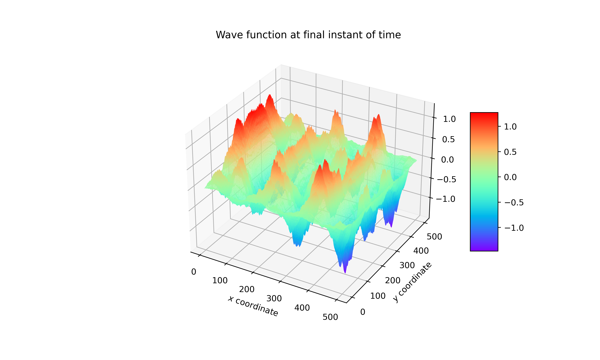

# Função de Onda Bidimensional

Alguns problemas de natureza física e matemática precisam ser resolvidos computacionalmente. No entanto, dependendo do tipo de problema, a resolução pode demorar muito ou gastar uma quantidade excessiva de memória. Com o intuito de melhorar o desempenho das resoluções de problemas que utilizam muitos dados, foram desenvolvidas uma série de soluções em computação utilizando técnicas de paralelismo. Abordamos, neste repositório, uma solução com base em técnicas de paralelismo voltadas à GPGPUs utilizando a API CUDA para o cálculo da solução do problema abordado.

# Relatório

O relatório final do trabalho está disponivel no pdf do repositório
